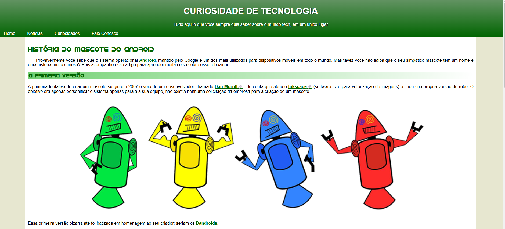
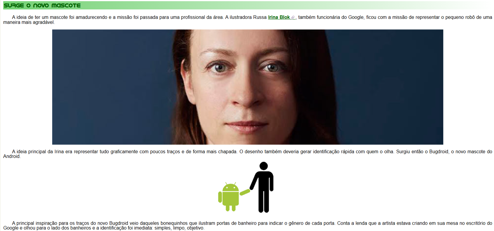

# História do Android 🤖📱

> Uma página web responsiva que conta a evolução do sistema operacional mobile mais utilizado do mundo.

## 💻 Sobre o projeto
Este site foi desenvolvido como um exercício prático focado nos alicerces do desenvolvimento web. O objetivo foi aplicar conceitos fundamentais de estruturação e estilização, garantindo boas práticas de código sem o uso de frameworks externos. É um projeto focado na construção de uma base técnica sólida de front-end.

## 🛠️ Tecnologias Utilizadas
* **HTML5:** Estruturação semântica de todo o conteúdo.
* **CSS3:** Estilização customizada, layout e responsividade (Media Queries).

## 🌟 Principais Conceitos Praticados
* **Semântica Web:** Aplicação correta de tags estruturais para melhorar a acessibilidade e o SEO.
* **Responsividade:** Adaptação fluida do layout para garantir uma boa experiência tanto em dispositivos móveis quanto em desktops.
* **CSS Puro (Vanilla):** Controle completo sobre o design, manipulação de cores, tipografia, espaçamentos e alinhamentos sem atalhos de ferramentas de terceiros.

## 📷 Demonstração do Layout
> 
